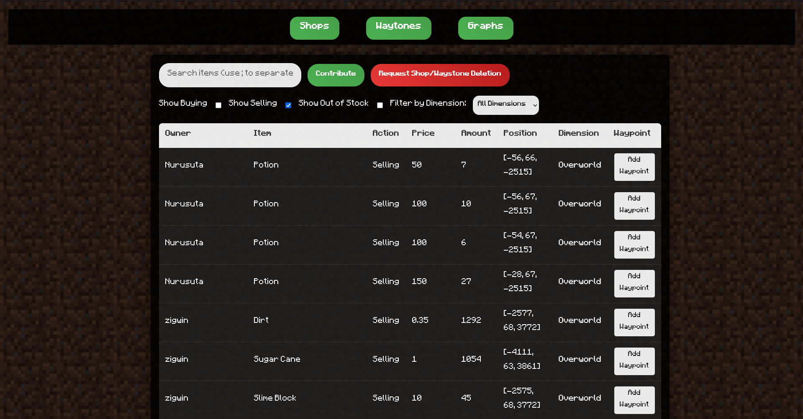

# About

[ASMP Utils](https://modrinth.com/mod/asmp-utils) is a minecraft mod with certain useful features when playing on the AtriocSMP.  

## Building

1. Clone the repository
2. Import the gradle project in your IDE
3. To start the project run the 'runClient' gradle task.
4. To build the project into a .jar run the 'build' gradle task.

## Configuration

The configuration file can be found in your Minecraft profile folder under 'configs/asmpshopget.json'.  
ASMP ShopGet also provides a [Mod Menu](https://modrinth.com/mod/modmenu/) api implementation for editing the config while in-game!  

## Features
### Player shop tracking

Player made shops are tracked through the mod and sent to a webserver which displays all available shops (with prices, owners, locations) on a easy to use website.

For more information see [asmp-shopsite](https://github.com/Kreiseljustus/asmp-shopsite)

### Waystone tracking
Waystones by players are tracked (basically) the same way as [shops](#player-shop-tracking) 

## Contributing

1. Fork the project
2. Make your changes
3. Open a pull request
4. Wait until its declined/accepted

# License

CC0 1.0 Universal
